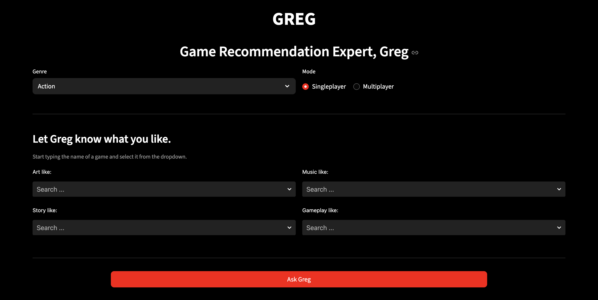
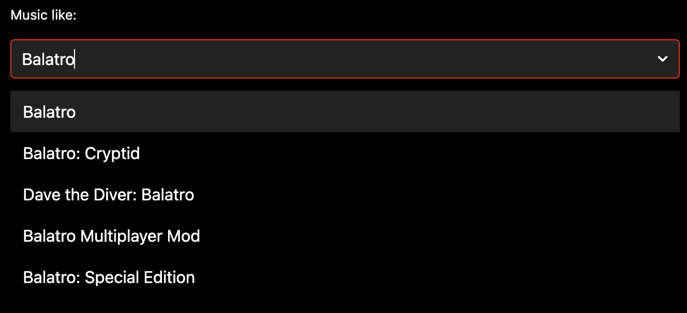
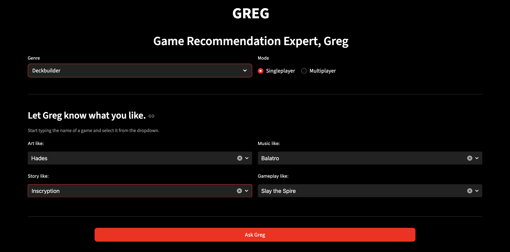
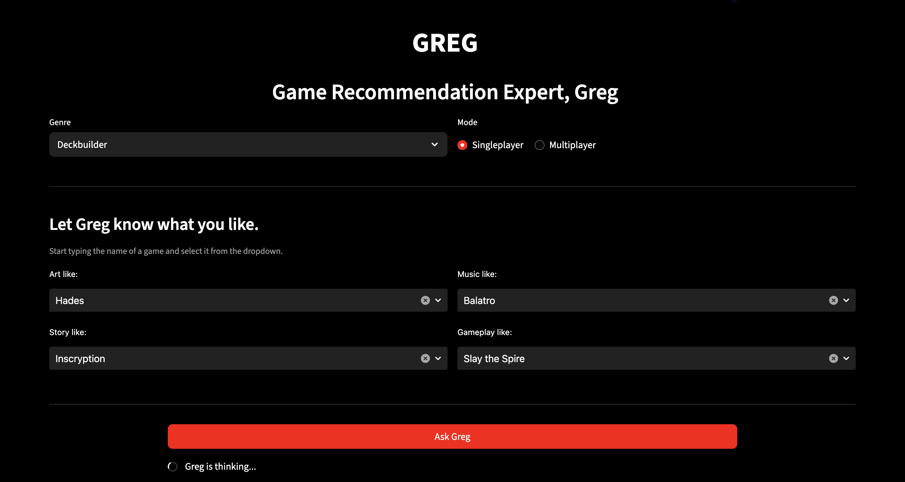
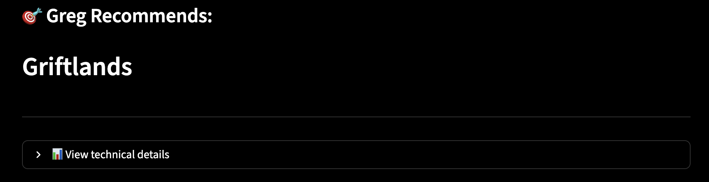
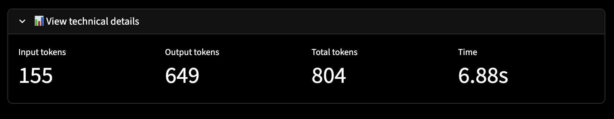

# GREG

**Game Recommendation Expert, Greg**

**Greg is a robot.** 
**Greg loves video games.** 
**Greg gives expert recommendations to his friends.** 
**Are you one of Greg's friends?** 
**There is only one way to find out...** 

Check it out <a href="https://game-recommendation-expert-greg.streamlit.app/">here</a>.

## Features
- Input form with **combo boxes** and **radio buttons**
- Uses **IGDB** (Internet Game Database) for autocomplete.
- The given information is crafted into a structured prompt and handed over to **GPT-5 nano**.
    - Uses OpenAI's new **responses API**
    - Returns exactly 1 game.
- Allows you to check out the technical details of the API call.
    - Input tokens
    - Output tokens
    - Total tokens
    - Request-to-response time

## Screenshots

  
  

  
  

  
  

## Get started

1. Clone the repository:
    git clone https://github.com/magnusapaulsen/greg.git
    cd greg

2. Install dependencies:
    pip install -r requirements.txt (pip3 install -r requirements.txt)

3. Get API-key, Client ID and Client Secret:
    Retrieve API-key from OpenAI.
    Retrieve Client ID and Client secret from IGDB.
    Put them inside a .env file (like shown in .env.example).

4. Run the Streamlit app locally:
    streamlit run main.py

5. Navigate the GUI:
    Select genre and mode.
    Tell Greg what you like.
    Hit the 'Ask Greg' button.

6. Check out the technical details:
    Click the dropdown for the technical details.

## Requirements
- `openai`
- `pip`
- `python-dotenv`
- `streamlit`
- `streamlit-searchbox`
- `requests`

List of dependencies is in `requirements.txt`.